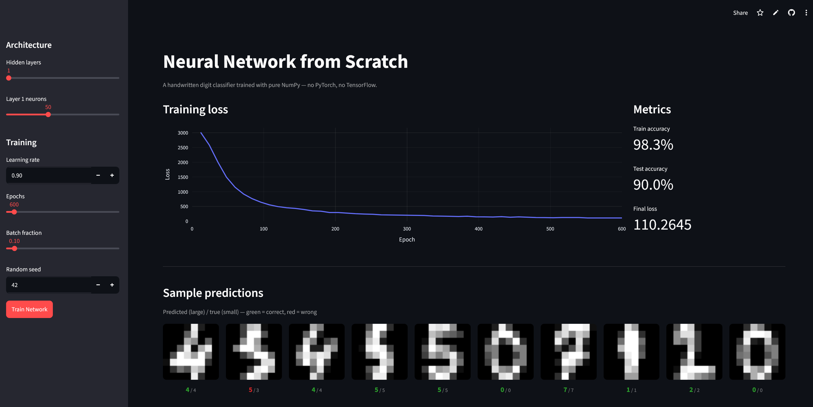

# Neural Network from Scratch

A fully-connected neural network built in pure NumPy, that learns to recognize handwritten digits with backpropagation and mini-batch gradient descent.

**[🌐 Live Demo](https://neural-network-from-scratch-stockifab.streamlit.app/)**



---

## 🎯  Features

- Backpropagation implemented from scratch using only NumPy
- Sigmoid and Softmax activation
- Binary and categorical cross-entropy loss functions
- Mini-batch gradient descent with configurable batch size
- `Network`, `Layer`, and `Connection` classes can form networks of arbitrary depth
- Trains a 64 -> 50 -> 10 network on the sklearn digits dataset and reaches 90% test accuracy

---

## ⏱️ Quick Start

You can try the live demo without installing anything at:

**[neural-net-from-scratch-stockifab.streamlit.app](https://neural-network-from-scratch-stockifab.streamlit.app/)**

### Local Setup

```bash
git clone https://github.com/stockifab/neural-network.git
cd neural-network
uv run main.py
```

To run the interactive Streamlit app locally:

```bash
streamlit run demo/app.py
```

---

## 🤖 AI Usage Declaration

- Everything inside the [src/](src/) folder, including the neural network implementation, was written entirely without AI assistance
- The Streamlit demo ([demo/](demo/)) was created using Claude
- AI was occasionally used for mathematical explanations

---

## 🧰 How It Works

The network is built as a pipeline that alternates `Layer` and `Connection` objects. During the forward pass each `Connection` multiplies activations by a weight matrix, each `Layer` applies a bias and an activation function.

Backpropagation walks the pipeline in reverse. For sigmoid layers the error is scaled by the local derivative `a * (1 - a)`. For the softmax output layer the Jacobian-vector product `a * (err - sum(err * a))` is used. Weight gradients are computed as `a_prev.T @ err / batch_size` and applied with vanilla SGD.
